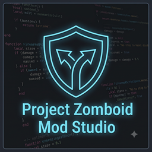

<div align="center">



# 🧟 Project Zomboid Mod Studio (PZ Mod Studio)

> **The ultimate desktop suite for managing, resolving conflicts, and ensuring mod compatibility in Project Zomboid (Build 42+ & legacy builds).**

[](https://opensource.org/licenses/MIT)
[](https://tauri.app/)
[](https://www.rust-lang.org/)
[](https://react.dev/)
[]()
[](https://github.com/Pichu6/-Project-Zomboid-Mod-Studio-PZ-Mod-Studio-/releases)

[**Download Portable (.exe)**](PZ-Mod-Studio-Portable/) • [**Technical Wiki (docs/)**](docs/INDEX.md) • [**AI Agent Guide (AGENTS.md)**](AGENTS.md)

</div>

---

## 🌟 Overview

**Project Zomboid Mod Studio** is a lightweight (~11 MB), portable desktop application engineered to eliminate the most common headaches in modded Project Zomboid: **virtual file overwrites**, **broken load orders**, **B41-to-B42 compatibility breaks**, and **unreadable crash logs**.

Unlike basic file combiners, PZ Mod Studio parses Lua scripts into a true **Abstract Syntax Tree (AST)** using the `full_moon` parser, performing a **3-Way Git-style merge** across Vanilla game files, Steam Workshop mods, and local additions. It packages all resolutions into an isolated synthetic mod (`Z_PZModStudio_MergedPatch`) that loads safely alongside your game.

---

## ✨ Key Features

| Module | Core Capabilities |
| :--- | :--- |
| **📂 Mod Profiles** | Save and switch between unlimited mod configurations (Solo, B42 Vanilla+, Co-op Server) with **1-click activation** directly into `ModListData.ini`. |
| **📋 Mod List Manager** | Auto-detects all Workshop and local mods. Features **Topological Dependency Sorting** (Kahn's Algorithm), health inspectors for missing/disabled dependencies, and shareable **`.pzpack` presets**. |
| **🔀 3-Way AST Mod Merger** | Detects Virtual File System (VFS) collisions and performs automated AST merges on Lua code and `.txt` scripts. Includes an integrated **Monaco Diff Editor** (VS Code engine). |
| **📊 Monitor Center & Diagnostics** | Streams live `console.txt` with noise filtering. Detects Java/Lua exceptions and generates **Crash Diagnostic Cards** with **1-click "Apply Fix" Polyfill rules**. |
| **🖥️ Dedicated Server Runner** | Launch dedicated servers with configurable RAM and `-nosteam` support. Monitor live connected players (health, coordinates, ping), send broadcast messages, and run live console commands. |
| **🤖 AI Agent Integration (MCP)** | Native **Model Context Protocol (MCP 2024-11-05)** server (`pz-mcp-server.exe`) enabling assistants (Claude Desktop, Cursor, Antigravity) to inspect logs, manage load orders, and run in-game live commands. |

---

## 🚀 Quick Start (Portable Edition)

No installer or administrative rights required:

1. Download the precompiled binaries directly from the [**`PZ-Mod-Studio-Portable/`**](PZ-Mod-Studio-Portable/) folder or from [**GitHub Releases**](https://github.com/Pichu6/-Project-Zomboid-Mod-Studio-PZ-Mod-Studio-/releases).
2. Inside `PZ-Mod-Studio-Portable`, you'll find:
   - **`Project-Zomboid-Mod-Studio.exe`** — The main desktop GUI application (~11 MB).
   - **`pz-mcp-server.exe`** — The standalone console MCP server for AI Agents (~1.9 MB).
3. Launch **`Project-Zomboid-Mod-Studio.exe`**.
4. The studio will auto-detect your Project Zomboid, Steam Workshop, and user folders.

---

## 🛠️ Building from Source (Developers & Contributors)

### Prerequisites
- [Node.js 22+](https://nodejs.org/)
- [Rust Stable Toolchain](https://rustup.rs/)
- Git

### Build & Run
```bash
# 1. Clone the repository
git clone https://github.com/Pichu6/-Project-Zomboid-Mod-Studio-PZ-Mod-Studio-.git
cd -Project-Zomboid-Mod-Studio-PZ-Mod-Studio-

# 2. Install dependencies
npm install

# 3. Launch in development mode (hot-reload frontend + Rust backend)
npm run tauri dev

# 4. Build production portable bundle
npm run build:portable
```

To build only the standalone MCP server binary:
```bash
cargo build --release --bin pz-mcp-server --manifest-path "src-tauri/Cargo.toml"
```

---

## 🤖 AI Agent & MCP Integration

PZ Mod Studio includes a dedicated CLI binary (`pz-mcp-server.exe`) that exposes 22 developer tools via standard JSON-RPC 2.0 over `stdio`.

Add this snippet to your assistant's configuration file (e.g. `claude_desktop_config.json`, `mcp.json`, or `.gemini/settings.json`):

```json
{
  "mcpServers": {
    "pz-mod-studio": {
      "command": "C:\\Path\\To\\PZ-Mod-Studio-Portable\\pz-mcp-server.exe",
      "args": []
    }
  }
}
```

For complete tool documentation, see [**`AGENTS.md`**](AGENTS.md).

---

## 📚 Technical Knowledge Base (`docs/`)

The repository includes a comprehensive, modular 9-chapter wiki detailing Project Zomboid's internal architecture:

- [**01. Engine Architecture, JVM & Kahlua VM**](docs/01-engine-architecture-kahlua-jvm.md)
- [**02. Lua Script Lifecycle & Event Bus**](docs/02-lua-lifecycle-and-events.md)
- [**03. Item Definitions, Crafting & Fluid API (B42)**](docs/03-crafting-items-and-fluids-b42.md)
- [**04. UI Hierarchy, Context Menus & Timed Actions**](docs/04-ui-context-menu-and-timedactions.md)
- [**05. Loot Distribution & Procedural Spawning**](docs/05-loot-distribution-and-spawns.md)
- [**06. ModData Persistence, Networking & Security**](docs/06-networking-moddata-and-security.md)
- [**07. FMOD Audio, JSON Translations & 3D Z-Levels**](docs/07-sound-translations-and-b42-space.md)
- [**08. Crash Diagnostics, VFS & 3-Way AST Merging**](docs/08-crash-diagnostics-and-vfs.md)
- [**09. Game Process Control & Live IPC Bridge**](docs/09-game-control-and-ipc-bridge.md)

See the [**Documentation Index**](docs/INDEX.md) for full details.

---

## 🤝 Contributing

Contributions are warmly welcomed! Please read [**`CONTRIBUTING.md`**](CONTRIBUTING.md) for details on code style, submitting polyfill rules, and opening Pull Requests.

---

## 📄 License

This project is licensed under the **MIT License** — see the [**`LICENSE`**](LICENSE) file for details.

---

<div align="center">
<i>Project Zomboid is a registered trademark of The Indie Stone. PZ Mod Studio is an unofficial community project.</i>
</div>
